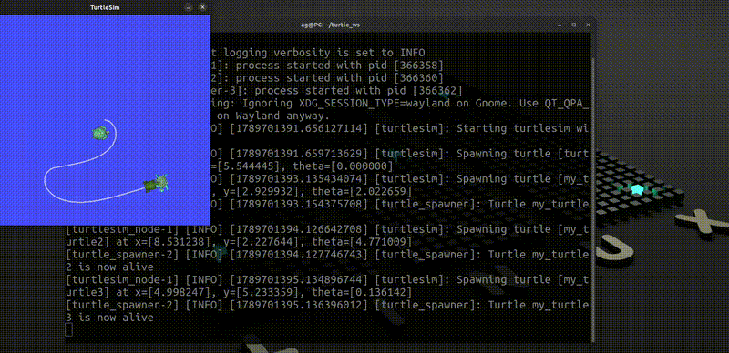

# Turtlesim Catch Them All

A ROS 2 project where a main turtle autonomously detects, selects, and catches spawned turtles using custom ROS 2 messages and services.

## Demo



## Features

* Automatic turtle spawning at random positions.
* Autonomous turtle navigation toward targets.
* Closest-turtle-first selection.
* Custom ROS 2 messages and services.
* Asynchronous service communication.
* Configurable parameters through ROS 2 launch files.
* Modular ROS 2 node architecture.

## System Architecture

```text
                    ┌─────────────────┐
                    │    Turtlesim    │
                    │                 │
                    │     turtle1     │
                    └───────┬─────────┘
                            │
                     turtle1/pose
                            │
                            ▼
                 ┌─────────────────────┐
                 │  Turtle Controller  │
                 │                     │
                 │ Target Selection    │
                 │ Distance Calculation│
                 │ Motion Control      │
                 └──────────┬──────────┘
                            │
                     turtle1/cmd_vel
                            │
                            ▼
                    ┌─────────────────┐
                    │    Turtlesim    │
                    └─────────────────┘

                 ┌─────────────────────┐
                 │   Turtle Spawner    │
                 │                     │
                 │ Spawn / Kill        │
                 │ Turtle Tracking     │
                 └──────────┬──────────┘
                            │
                     alive_turtles
                            │
                            ▼
                 ┌─────────────────────┐
                 │  Turtle Controller  │
                 └─────────────────────┘

Turtle Controller ───── catch_turtle ─────► Turtle Spawner
Turtle Spawner ─────────── spawn ─────────► Turtlesim
Turtle Spawner ─────────── kill ──────────► Turtlesim
```

## ROS 2 Nodes

### Turtle Controller

The `turtle_controller` node:

* Subscribes to the main turtle pose.
* Receives the list of alive turtles.
* Selects the closest turtle when enabled.
* Calculates the distance and heading to the target.
* Publishes velocity commands.
* Calls the `catch_turtle` service when the target is reached.

### Turtle Spawner

The `turtle_spawner` node:

* Spawns turtles periodically.
* Generates random positions and orientations.
* Maintains a list of alive turtles.
* Publishes the alive turtle list.
* Provides the `catch_turtle` service.
* Removes caught turtles from the alive turtle list.

## Topics

| Topic              | Type                                | Direction           | Description                   |
| ------------------ | ----------------------------------- | ------------------- | ----------------------------- |
| `/turtle1/pose`    | `turtlesim/msg/Pose`                | Subscribe           | Main turtle pose              |
| `/turtle1/cmd_vel` | `geometry_msgs/msg/Twist`           | Publish             | Main turtle velocity          |
| `/alive_turtles`   | `turtle_interfaces/msg/TurtleArray` | Publish / Subscribe | List of active target turtles |

## Services

| Service         | Type                                | Description            |
| --------------- | ----------------------------------- | ---------------------- |
| `/spawn`        | `turtlesim/srv/Spawn`               | Spawn a turtle         |
| `/kill`         | `turtlesim/srv/Kill`                | Remove a turtle        |
| `/catch_turtle` | `turtle_interfaces/srv/CatchTurtle` | Request a turtle catch |

## Custom Interfaces

### `Turtle.msg`

Contains the information of an individual target turtle:

```text
float32 x
float32 y
float32 theta
string name
```

### `TurtleArray.msg`

Contains a list of active turtles:

```text
Turtle[] turtles
```

### `CatchTurtle.srv`

Used to request catching a specific turtle:

```text
string name
---
bool success
```

## Parameters

### Turtle Controller

| Parameter                    | Default | Description                     |
| ---------------------------- | ------: | ------------------------------- |
| `frequency`                  |   `100` | Controller update frequency     |
| `catch_closest_turtle_first` |  `true` | Select the closest turtle first |

### Turtle Spawner

| Parameter   |  Default | Description               |
| ----------- | -------: | ------------------------- |
| `frequency` |    `1.0` | Turtle spawning frequency |
| `prefix`    | `turtle` | Turtle name prefix        |
| `counter`   |      `0` | Initial turtle counter    |

## Requirements

* Ubuntu 22.04
* ROS 2 Humble
* Python 3
* `turtlesim`
* `rclpy`
* `geometry_msgs`

## Build

Create or navigate to your ROS 2 workspace:

```bash
cd ~/turtle_ws
```

Build the workspace:

```bash
colcon build --symlink-install
```

Source the workspace:

```bash
source install/setup.bash
```

## Run

Launch the complete project:

```bash
ros2 launch turtle_bringup turtlesim_catch_them_all.launch.py
```

The launch file starts:

* Turtlesim
* Turtle Spawner
* Turtle Controller

## Project Structure

```text
turtle_ws/
├── README.md
├── .gitignore
├── media/
│   └── turtlesim_demo.gif
└── src/
    ├── turtle_interfaces/
    │   ├── msg/
    │   │   ├── Turtle.msg
    │   │   └── TurtleArray.msg
    │   └── srv/
    │       └── CatchTurtle.srv
    │
    ├── turtlesim_catch_them_all/
    │   ├── turtlesim_catch_them_all/
    │   │   ├── turtle_controller.py
    │   │   └── turtle_spawner.py
    │   ├── package.xml
    │   ├── setup.py
    │   └── setup.cfg
    │
    └── turtle_bringup/
        ├── launch/
        │   └── turtlesim_catch_them_all.launch.py
        └── package.xml
```

## How It Works

1. Turtlesim starts with `turtle1`.
2. The spawner periodically creates new turtles.
3. Each successfully spawned turtle is added to the alive turtle list.
4. The spawner publishes the list through `/alive_turtles`.
5. The controller receives the list and selects a target.
6. The controller calculates the distance and heading to the target.
7. Velocity commands are published to `/turtle1/cmd_vel`.
8. When the main turtle reaches the target, the controller calls `/catch_turtle`.
9. The spawner requests the target turtle to be killed through `/kill`.
10. The caught turtle is removed from the alive turtle list.
11. The process continues with the remaining turtles.

## Learning Objectives

This project demonstrates practical ROS 2 concepts including:

* ROS 2 Nodes
* Publishers and Subscribers
* Services and Clients
* Custom Messages
* Custom Services
* Parameters
* Launch Files
* Timers
* Asynchronous Service Calls
* Basic autonomous motion control
* Multi-node ROS 2 architecture

## License

This project is intended for educational and robotics development purposes.

